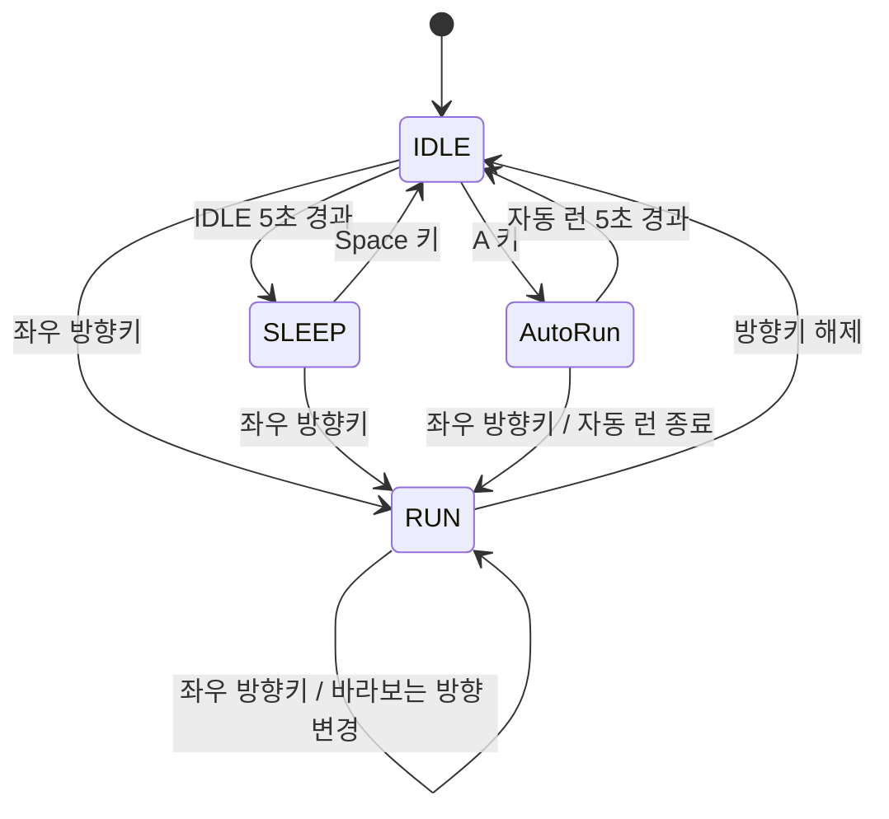

# DRILL-11 상태 다이어그램

```mermaid
stateDiagram-v2
    [*] --> IDLE
    IDLE --> AutoRun: A 키
    IDLE --> RUN: 좌우 방향키
    IDLE --> SLEEP: IDLE 5초 경과
    SLEEP --> IDLE: Space 키
    SLEEP --> RUN: 좌우 방향키
    RUN --> RUN: 좌우 방향키 / 바라보는 방향 변경
    RUN --> IDLE: 방향키 해제
    AutoRun --> IDLE: 자동 런 5초 경과
    AutoRun --> RUN: 좌우 방향키 / 자동 런 종료
```

`ESC` 키 또는 창 닫기는 게임 루프를 종료하며 캐릭터 상태 전이에는 포함하지 않는다. AutoRun 종료 시 일반 크기와 동작으로 복원하고 IDLE 타이머를 초기화한다.
